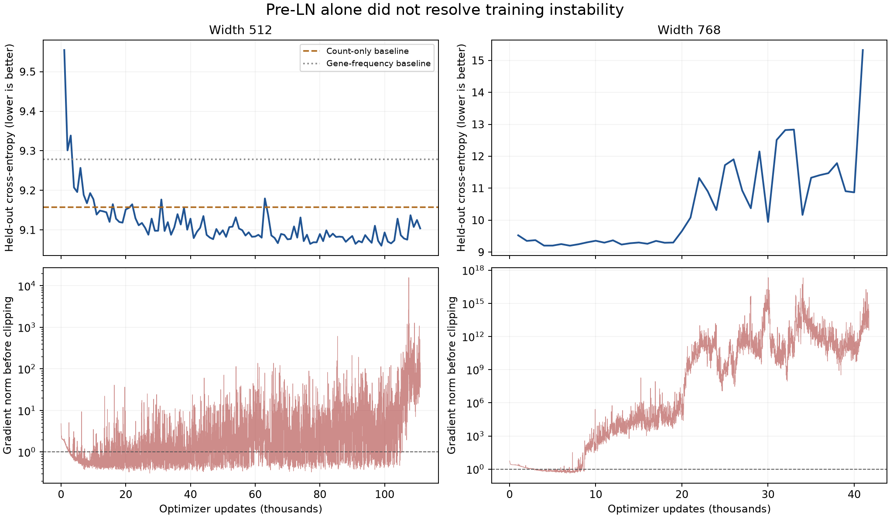

# Attention instability investigation — September 22, 2026

The pre-LN change did not resolve long-run training. The width-768 run diverged;
the width-512 run learned a small amount but plateaued. Both full runs remain stopped. Paired streaming continuation tests and a
separate sampling comparison are complete; results below do not establish a
complete long-run recovery.
Follow-up implementation and BF16 validation are recorded in
[the QK-normalization report](../bf16-qknorm-20260922/README.md).
The historical scripts here explicitly disable QK normalization to reproduce
the original architecture.

The experiments below used code commit 2168ce0, PyTorch 2.14.0+cu130, and H100 GPUs.

## Confirmed numerical failure

At width 768, checkpoint step 41,000, on the same eight held-out cells:

| Computation | Attention dropout | Other dropout | Gradient norm |
| --- | ---: | ---: | ---: |
| BF16, default backend | 0.1 | 0.1 | 4.14e12 |
| BF16, forced memory-efficient backend | 0.1 | 0.1 | 4.14e12 |
| BF16, forced math backend | 0.1 | 0.1 | 134.9 |
| FP32, default backend | 0.1 | 0.1 | 36.7 |
| BF16, default backend | 0 | 0.1 | 7.71 |
| BF16, default backend | 0 | 0 | 7.93 |

Backend RNG implementations can generate different dropout masks; these are not
identical-mask comparisons. A second seed reproduced the large BF16 discrepancy,
and the data-independent experiment below removes that ambiguity. The compiled
and eager models both exhibit the failure, so this is not solely a compile issue.
Disabling dropout during evaluation explains why evaluation-only gradient checks
missed the training failure.

`scripts/diagnose_attention_numerics.py` isolates the numerical error with no
model/checkpoint/dataset. Queries have softmax logit ~1021 at one key and zero
elsewhere. All attention probability goes to that key, so query/key gradients
should be zero irrespective of the dropout mask. With BF16 and dropout 0.1,
the memory-efficient backend returns query gradient norm 21.71; the math backend
returns zero. With dropout zero, the memory-efficient result is about 0.00113.
FP32 with dropout gives about 0.00201. Dropout 0.5 also reduces the BF16 artifact
to about 0.00162; unlike 1/0.9, its rescaling factor 2 is exactly representable.
This is consistent with dropout/output-rounding errors in attention backward;
we have not audited the CUDA kernel implementation or filed an upstream report.

The real model reaches this sensitive regime: sampled attention rows with a
largest weight above 0.99 increase from 18% at width-768 step 7,000 to 74% at
step 41,000. At width 512, the corresponding probe rises from 50% at step 99,000
to 65% at step 111,000. These are small eight-cell probes averaged across layers,
heads and 16 query positions, not population-wide estimates. Maximum sampled
attention logits at the failed 768 checkpoint exceed five million.

Huge early-layer gradients dominate global clipping and distort the optimizer's
relative learning signals. Clipping to norm 1 prevents large raw updates but
does not make incorrect gradients correct. We have established an immediate
failure mechanism; removing it alone does not establish good generalization.
Why attention became so saturated remains an optimization question.

## Width-512 plateau

On the same 6,400 validation cells, a step-107,000 checkpoint gives loss 9.07594.
A gene-frequency prior fitted to 50,000 training cells gives 9.27842, and a
count-conditioned prior gives 9.15736. The model improves only ~0.0814 nats over
the latter. Top-1 accuracy is 10/6,400 versus 8/6,400 for that count baseline.
Replacing each cell's context with another cell's context while retaining its
MASK count worsens loss to 9.36647. Thus the model has learned some context
information; it has not completely collapsed to a constant predictor. This
ablation changes both visible identities and counts, so it does not establish
which context features it uses.

The step-111,000 checkpoint's gradient norm on the same eight-cell probe is
108.3 with attention dropout and 7.06 without it (other dropout unchanged).
This supports a related instability, but does not prove it explains the entire
plateau. The stronger numerical reproduction is at width 768.

## Sampling mismatch

The current 4,096-cell block shuffle is not a global random cell shuffle. In a
16,512-cell sample, every 128-cell batch came from one shard. Global random
sampling averaged 127.4 shards per batch. On the same node, 8 workers supplied
3,723 random cells/sec versus 14,587 block-shuffled cells/sec, both above the
models' training consumption. This benchmark used current OS cache, no explicit
prewarming, and concurrent GPU training; it is not a cold-cache guarantee.
This is a confirmed mismatch with the desired sampling pattern, not a proven
cause of the loss plateau. Paired dropout tests retain the same block sampler
so they change only attention dropout.

## Code safeguards

The candidate code defaults attention dropout to zero while retaining the
other dropout layers at 0.1, and exposes `--attention-dropout` explicitly.
`--max-grad-norm` stops before an optimizer update when the finite, pre-clipping
gradient norm exceeds 1,000. Previously, only nonfinite gradients stopped a run.
Ten training-loop integration tests pass, including a check that the guard
prevents the optimizer update. This is not evidence of a completed healthy run.

## Source

PyTorch documents float32 intermediates for the math attention backend when
inputs are BF16: https://docs.pytorch.org/docs/stable/generated/torch.nn.functional.scaled_dot_product_attention.html
The diagnosis itself is based on the local reproductions and checkpoint probes.
Search output is saved locally at `/tmp/andre-sdpa-precision.json`.

## Stronger baseline: exclude visible genes

The missing gene cannot also be in the visible input, because a cell has unique
gene IDs and sampling is without replacement. A count-conditioned prior that
sets visible genes' probabilities to zero and renormalizes gets loss **9.07935**.
Applying the exact same rule to the best width-512 checkpoint (step 99,000)
gives **8.96729**, versus its unmodified **9.06066**. Thus its context learning
is modest but extends beyond this simple exclusion rule. This is a post-hoc
read-only evaluation; the model/loss implementation has not been changed to
exclude visible output classes. No validation labels were used to fit the prior.

## Interpretation and further work

LayerNorm on the input to attention does not bound the learned query/key
projections' outputs. Saturated attention remains an issue even after disabling
attention dropout. This resembles the attention-entropy collapse studied by
Zhai et al., who connect sharp attention and unstable gradients to projection
spectral norms. That paper supports investigating control of query/key scale;
it does not prove that its proposed reparameterization will solve this dataset.
We have not changed query/key normalization or claimed that a lower learning
rate alone is a proven solution.

Primary paper: https://arxiv.org/html/2303.06296v2
Search record saved locally: `/tmp/andre-attention-entropy.json`.

## Matched 1,500-update continuation tests

All width-512 variants start from the same step-99,000 model **and AdamW state**,
use LR 3e-4, batch 128, 512 positions and the same 6,400 validation cells/masks.
Each receives 192,000 training cells. Dropout comparisons use the same training
cells and worker sampling seed; the sampling comparison changes the cell draw.
Residual/feed-forward dropout remains 0.1. None of these overwrite full-run
checkpoints. Intermediate evaluations use 1,024 cells; only the initial and final
6,400-cell evaluations should be compared with the full-run validation loss.

| Width-512 continuation | Final validation loss |
| --- | ---: |
| Starting checkpoint (no updates) | 9.06036 |
| Attention dropout 0.1, 4,096-cell block sampling | 9.08774 |
| Attention dropout 0, same block sampling | 9.10321 |
| Attention dropout 0, globally mixed cells | 9.04538 |

Disabling attention dropout alone did **not** improve held-out learning in this
comparison. It lowered typical gradient norms (median of 25-step window medians
4.37 -> 1.13), but did not eliminate large spikes: the largest measured norms
were 261 and 333 respectively. Do not describe this as a complete stability fix.

Global sampling improves the matched dropout-off result by 0.05783 nats and
improves on the starting checkpoint by 0.01498 nats. This supports sampling as
a contributor to the plateau, but is one seed and a short continuation, not a
completed scaling-law run or proof of durable recovery. The original checkpoints
already contain the effects of the old recipe.

The trainer now defaults to a uniform global permutation, without replacement,
using the existing sampler with one corpus-sized block. It needs ~0.98 GB for
the index array, does not load expression matrices, and visits each training
cell once per epoch. `--sampling block` preserves the old behavior explicitly.
The bounded experiment uses an equally uniform subset drawn with Python's
`random.sample`; its exact permutation differs from the production NumPy RNG.

For width 768, the same 1,500-update comparison from step 7,000 finishes at
loss **9.18999** with attention dropout 0.1 and **9.18245** with dropout 0.
Maximum gradient norms are 9.39 and 2.36 respectively. **Neither short continuation
reproduced the original long-run explosion**, so these tests do not establish
that disabling dropout prevents its eventual recurrence. The failed-checkpoint
and data-independent reproductions establish the numerical failure itself.

All five bounded continuation variants completed. The full training services
remain stopped, and both best checkpoints were downloaded locally and verified:
width 512 step 99,000; width 768 step 7,000. Ten training-loop integration tests
pass after the sampling change. There are no configured hosted GitHub checks.

